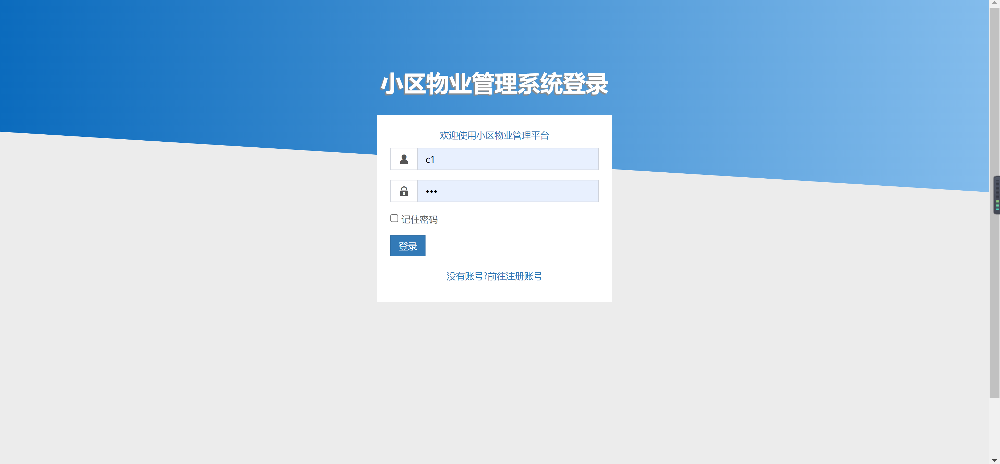
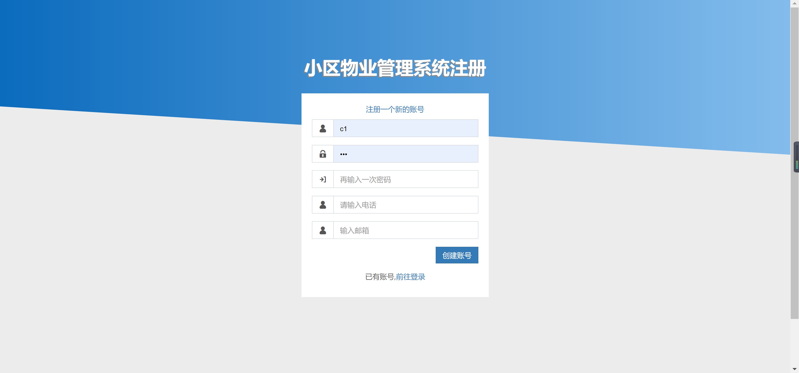
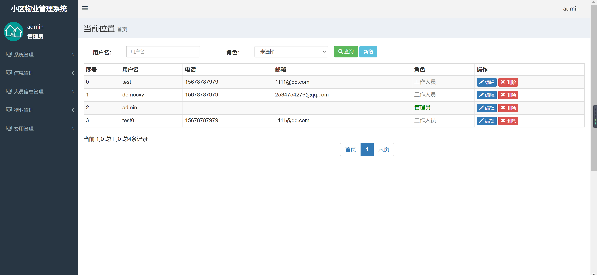
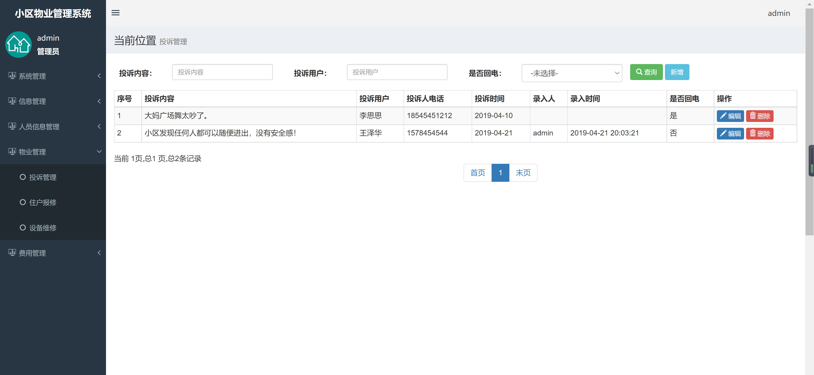
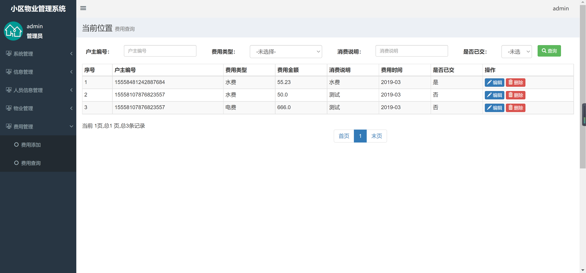

<h1 align="center">小区物业管理系统2</h1>

## 简介
小区物业管理系统2：角色分为管理员、用户；主要功能包括用户管理、费用查询、投诉管理、登录、注册，通过简洁界面实现高效物业管理与服务。    --计算机毕业设计源码；毕设源码；java毕业设计源码

## 联系方式

<h3 align="center">获取完整代码与数据库文件 + 微信：deepguan QQ: 86050149 QQ群: 783742310</h3>

<h3 align="center">可帮忙远程部署 包运行成功！提供远程部署、修改代码、设计文档指导、代码讲解等服务！</h3>

## 功能介绍（完整见运行截图）
管理员：负责编制和管理小区物业管理系统的功能模块，包括系统管理、信息管理、人员信息管理、物业管理和费用管理。通过用户管理界面进行用户信息管理，编辑或删除用户数据，确保系统的正常运作。处理投诉管理，通过新增和查询功能查看或添加记录。负责费用查询，通过筛选信息确认住户的缴费状态，进行数据编辑或删除。查看系统登录和注册情况，以便管理用户账号。

用户：注册并通过系统登录界面进入小区物业管理平台，享受各项便捷服务。使用费用查询功能查看自己的缴费信息和状态，以及编辑个人信息。可以在投诉管理页面提交投诉，并通过界面操作查看自身投诉记录。用户管理页面允许用户查询自身信息的正确性，与管理员协作，确保系统信息的完整性。一旦账户创建，便能享受简洁的操作界面进行各项必要物业服务的使用。

## 运行截图

本代码来源于网络,仅供学习参考使用!

